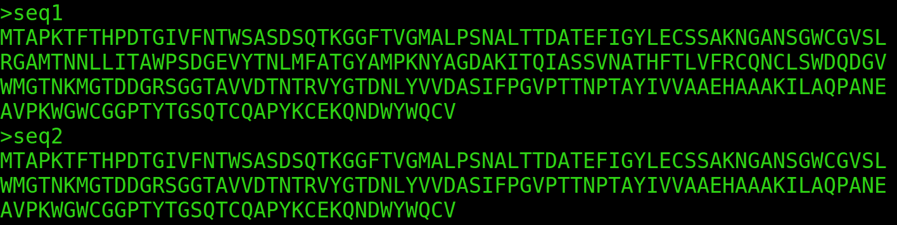

# protParamWrap
A wrapper to submit multiple sequences to calculate protein parameter.
# Requirements
- [Julia](https://julialang.org/)
  - module [protParam](https://github.com/zmactep/ProtParam.jl) *(the package has to be included into julia)*
  - module BioSequences *(the package has to be included into julia)*
- Installation of Julia and modules can be found [here](https://medium.com/@erikbreslmayr/protparam-standalone-bfa38932e946).
## Workflow
- `.fasta` files are seperated into single files
- `.protParam.jl` files are generated for each sequence 
- `.jl` files are processed by julia and protParam
- results are saved in the `summary.txt` file

# Web Server

- ProtParamWrap is also available as [Web Tool](http://illuzymes.com/), however compared to a local machine the server is relatively slow!
# Citation

> Breslmayr, E. (2021). protParamWrap - A tool for submission and calculation of multiple protein sequence parameters (Version v1.0).  Zenodo. http://doi.org/10.5281/zenodo.4770671

# Installation

Bash script, just make it executable and run
## SourceCode compiling with Argbash - argument parser generator
template file can be changed and converted to executable code (tested with argbash_2.10; Ubuntu_16.04, 20.04)

`argbash protParamWrap_template -o protParamWrap`
### Problems
- Fasta file must look like this:

- Amino acid sequence in the .fasta file can only include standard amino acids like `'RHKDESTNQCGPAVILMFYW'`; otherwise protParam crashes!
- If sequence names have a space in between (e.g. >seq1 name), everything after the first space will be ignored. Best is to connect the words (e.g. >seq1_name).